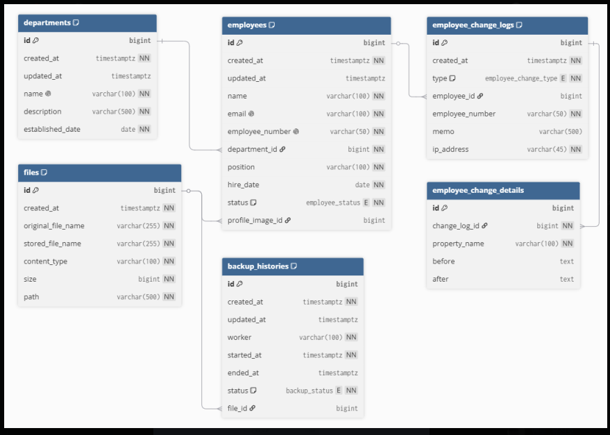

# HRBank

기업의 직원, 부서, 근태, 변경 이력 및 백업 데이터를 통합적으로 관리하기 위한 인사 관리 백엔드 시스템입니다.

---

## 1. 프로젝트 소개

HRBank는 기업의 인사 데이터를 체계적으로 관리하기 위해 개발한 백엔드 프로젝트입니다.

직원과 부서 정보를 관리하고, 직원 등록·수정·삭제 과정에서 발생한 변경 이력을 기록하고 조회할 수 있습니다. 또한 파일 관리와 데이터 백업 기능을 통해 인사 데이터를 안정적으로 보관할 수 있도록 구현했습니다.

| 구분 | 내용 |
| --- | --- |
| 프로젝트명 | HRBank |
| 개발 형태 | 백엔드 팀 프로젝트 |
| 개발 기간 | 2026.07.08 ~ 2026.07.20 |
| 개발 인원 | 6명 |
| GitHub | [sb13-HRBank-team04] (https://github.com/Sprint-4team/sb13-HRBank-team04) |

---

## 2. 주요 기능

### 직원 관리

- 직원 등록, 조회, 수정, 삭제
- 직원 목록 검색 및 정렬
- 직원 상세 정보 및 통계 조회
- 직원 프로필 이미지 관리

### 부서 관리

- 부서 등록, 조회, 수정, 삭제
- 부서 목록 검색 및 정렬
- 부서별 직원 수 조회

### 직원 정보 변경 이력 관리

- 직원 등록·수정·삭제 시 `CREATED`, `UPDATED`, `DELETED` 이력 저장
- 실제로 변경된 속성만 변경 전·후 값으로 기록
- 메모와 요청 IP 주소 저장
- 사원번호·유형·메모·IP 주소·기간 조건 검색
- 변경 시각 또는 IP 주소 기준 정렬
- 복합 커서 기반 페이지네이션
- 변경 이력 목록·상세·기간별 건수 조회
- 직원 삭제 후에도 기존 변경 이력 유지

### 직원 근태 관리

- 직원 근태 정보 생성, 수정, 삭제
- 직원별 근태 정보 조회
- 기간별 근태 정보 조회

### 파일 관리

- 프로필 이미지, 백업 파일 및 오류 로그 파일 관리
- 파일 메타 정보(DB), 실제 파일(uploads 폴더) 분리해 저장
- Local Storage 기반 파일 업로드 및 다운로드, 삭제


### 데이터 백업 관리

- 전체 직원 데이터를 CSV 파일로 백업
- 데이터 변경이 없으면 백업 생략
- 백업 실패 시 오류 로그 파일 생성
- 스케줄러를 이용한 자동 백업

---

## 3. 기술 스택

### Backend

- Java 17
- Spring Boot
- Spring Data JPA
- Spring Scheduler
- QueryDSL
- Lombok
- Gradle

### Database

- PostgreSQL

### API Documentation

- Springdoc OpenAPI
- Swagger UI

### Collaboration

- Git
- GitHub
- Notion
- Discord

### Development Tools

- IntelliJ IDEA
- Railway Volume

---

## 4. 팀원 및 역할

| 팀원 | 담당 기능 |
| --- | --- |
| 장준서 | 직원 정보 관리 · 발표 |
| 백한천 | 데이터 백업 조회 · 근태 관리· 발표 자료 취합 |
| 박민재 | 데이터 백업 · 시연 영상 |
| 김지원 | 직원 정보 수정 이력 관리 · 발표 자료(PPT) 제작 |
| 유승완 | 부서 관리 · 배포 |
| 최진희 | 파일 관리 · 발표 자료 취합 |

### 공통 작업

- 요구사항 분석 및 기능 분담
- ERD 및 엔티티 구조 설계
- API 명세 검토
- Pull Request 기반 코드 리뷰
- Swagger를 활용한 API 테스트
- 기능 통합 및 오류 수정

---

## 5. 시스템 아키텍처

역할과 책임을 분리하기 위해 계층형 아키텍처를 적용했습니다.

```text
Client
  │
  ▼
Controller
  │
  ▼
Service
  │
  ▼
Repository
  │
  ▼
PostgreSQL
```

- `Controller`: HTTP 요청 및 응답 처리
- `Service`: 비즈니스 로직 및 트랜잭션 처리
- `Repository`: Spring Data JPA를 통한 데이터베이스 접근
- `PostgreSQL`: 직원, 부서, 근태, 변경 이력, 파일 및 백업 이력 저장

---

## 6. ERD



### 주요 연관관계

- 하나의 부서는 여러 직원을 가질 수 있습니다.
- 하나의 직원은 여러 근태 정보와 변경 이력을 가질 수 있습니다.
- 하나의 변경 이력은 여러 변경 상세 정보를 가질 수 있습니다.
- 변경 이력에는 사원번호를 별도로 저장하여 직원 삭제 후에도 과거 이력을 유지합니다.
- 직원은 프로필 이미지 파일을 가질 수 있습니다.
- 하나의 백업 이력은 최대 하나의 파일을 가질 수 있습니다.
- 진행 중이거나 생략된 백업 이력에는 파일이 존재하지 않을 수 있습니다.

---

## 7. API 명세

전체 API의 자세한 요청 및 응답 형식은 Swagger UI에서 확인할 수 있습니다.

```text
https://codeit-4team-hrbank-production.up.railway.app/swagger-ui/index.html
```

### 주요 API

| 기능 | Method | Endpoint |
| --- | --- | --- |
| 직원 목록 조회 | `GET` | `/api/employees` |
| 직원 등록 | `POST` | `/api/employees` |
| 부서 목록 조회 | `GET` | `/api/departments` |
| 부서 등록 | `POST` | `/api/departments` |
| 직원 정보 수정 이력 목록 조회 | `GET` | `/api/change-logs` |
| 직원 정보 수정 이력 상세 조회 | `GET` | `/api/change-logs/{id}` |
| 근태 목록 조회 | `GET` | `/api/attendances` |
| 파일 다운로드 | `GET` | `/api/files/{id}/download` |
| 백업 생성 | `POST` | `/api/backups` |
| 백업 이력 목록 조회 | `GET` | `/api/backups` |

---

## 8. 실행 방법

### 저장소 복제

```bash
git clone https://github.com/Sprint-4team/sb13-HRBank-team04
cd sb13-HRBank-team04
```

### PostgreSQL 데이터베이스 생성

```sql
CREATE DATABASE hrbank;
```

### 환경 설정

`src/main/resources/application.yaml`에 데이터베이스와 파일 저장 경로를 설정합니다.

```yaml
spring:
  datasource:
    url: jdbc:postgresql://localhost:5432/hrbank
    username: postgres
    password: ${DB_PASSWORD}

  jpa:
    hibernate:
      ddl-auto: update

file:
  upload-dir: uploads

backup:
  schedule:
    interval: 3600000
```

데이터베이스 비밀번호와 같은 민감한 정보는 환경 변수로 관리합니다.


### Swagger UI 접속

```text
https://codeit-4team-hrbank-production.up.railway.app/swagger-ui/index.html
```

---

## 9. 프로젝트 문서 및 시연 영상

- [프로젝트 개인 보고서] (https://app.notion.com/p/39907917646580669840d44a6f2070d6)
- [협업 규칙] (https://app.notion.com/p/397079176465808c9187f635a45a0649)
- [프로젝트 시연 영상] (https://drive.google.com/file/d/11gdYvxtxOCJaUc0tiauNUYRpKxkdwfUj/view?usp=drive_link)

프로젝트의 상세 설계, 트러블슈팅 및 팀원별 회고는 프로젝트 보고서에서 확인할 수 있습니다.